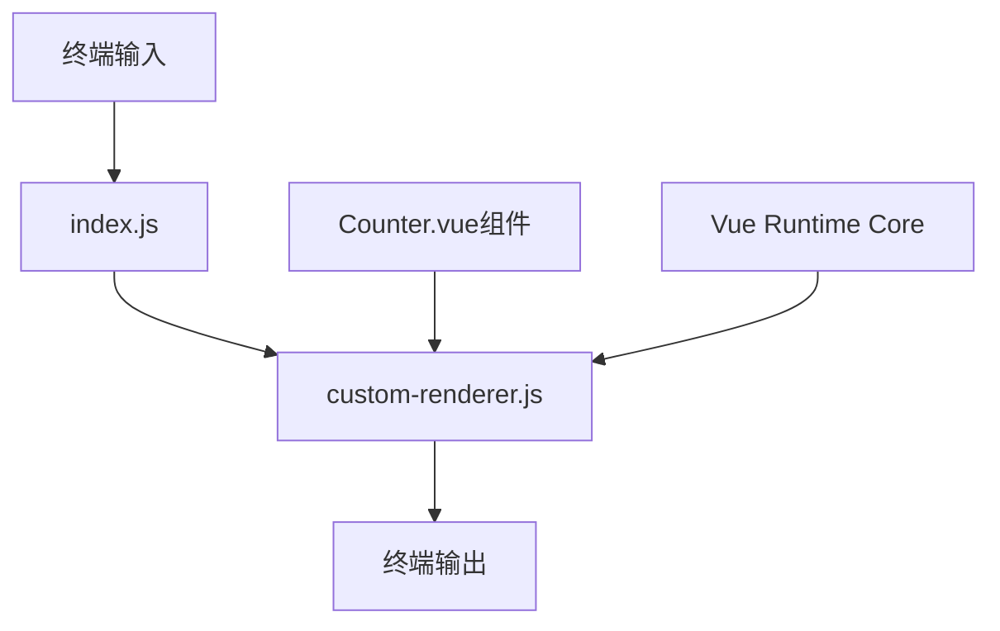
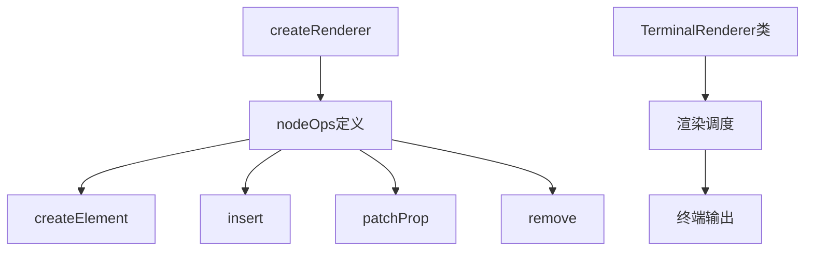
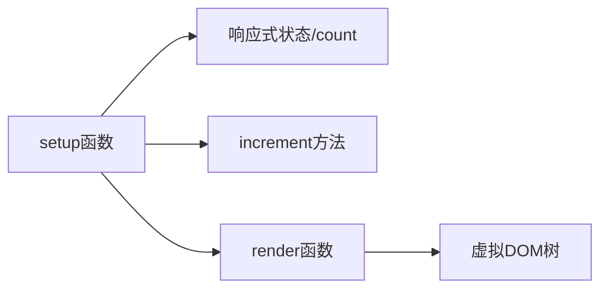
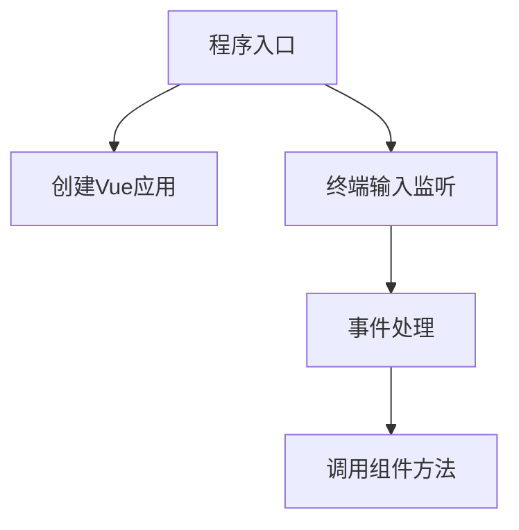
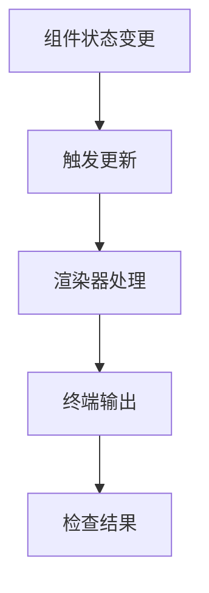
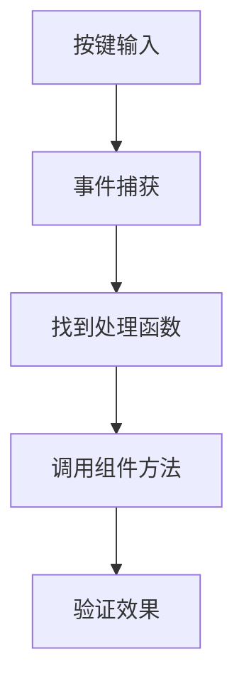
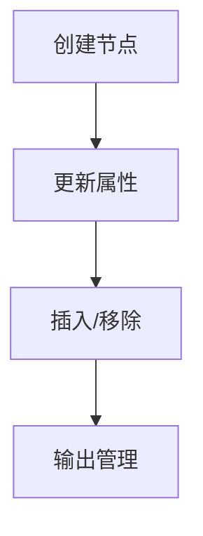

# Vue终端渲染器项目设计与分析

## 问题分析

### 核心需求
1. 在终端环境中渲染Vue组件
2. 实现计数器功能（按回车增加计数）
3. 脱离DOM环境，实现自定义渲染

### 技术难点
1. Vue组件如何在无DOM环境下渲染
2. 终端输入与组件状态如何交互
3. 渲染更新如何触发终端刷新

## 系统架构



## 模块设计

### 1. 自定义渲染器 (custom-renderer.js)


职责：
- 创建和管理虚拟节点
- 处理节点属性和事件
- 调度终端渲染
- 管理输出刷新

### 2. Counter组件 (components/Counter.js)


职责：
- 管理计数状态
- 提供增加计数方法
- 定义渲染结构

### 3. 入口文件 (index.js)


职责：
- 初始化应用
- 处理用户输入
- 连接组件和终端交互

## 调试策略

### 1. 渲染流程调试


调试步骤：
1. 检查组件状态是否正确更新
2. 验证渲染器是否收到更新信号
3. 确认终端输出是否刷新
4. 观察最终显示效果

### 2. 事件流程调试


调试步骤：
1. 确认键盘事件是否被捕获
2. 验证事件处理函数是否执行
3. 检查组件方法是否被调用
4. 观察状态是否更新

### 3. 渲染器调试


调试要点：
1. 节点创建是否正确
2. 属性更新是否生效
3. 节点操作是否反映到输出
4. 终端显示是否符合预期

## 问题定位与解决

### 常见问题及解决方案

1. 计数不增加
   ```mermaid
   graph TD
       A[现象: 按回车无反应] --> B{诊断流程}
       B --> C[检查事件监听]
       B --> D[验证组件方法]
       B --> E[确认渲染更新]
   ```
   解决步骤：
   - 检查终端输入监听是否正确
   - 验证组件方法是否被调用
   - 确认状态更新是否触发渲染

2. 显示异常
   ```mermaid
   graph TD
       A[现象: 显示不正确] --> B{诊断流程}
       B --> C[检查渲染逻辑]
       B --> D[验证节点结构]
       B --> E[确认输出格式]
   ```
   解决步骤：
   - 检查渲染器输出逻辑
   - 验证虚拟DOM结构
   - 确认终端格式化正确

### 调试工具与技巧

1. 代码跟踪
   - 使用console.log记录关键节点
   - 设置断点观察数据流转
   - 监控状态变化

2. 环境验证
   - 确认Node.js版本兼容性
   - 验证依赖包完整性
   - 检查终端环境设置

## 最佳实践

1. 状态管理
   - 使用Vue的响应式系统
   - 集中管理组件状态
   - 明确状态更新流程

2. 事件处理
   - 统一事件处理机制
   - 清晰的事件传播链路
   - 合理的错误处理

3. 渲染优化
   - 最小化渲染范围
   - 优化更新频率
   - 合理的缓存策略

## 扩展思考

1. 性能优化
   - 批量更新处理
   - 选择性渲染
   - 缓存机制

2. 功能扩展
   - 支持更多终端特性
   - 添加更多交互方式
   - 实现更复杂的布局

## 总结

本项目通过实现一个简单的终端计数器，展示了如何在非浏览器环境中使用Vue的核心功能。关键在于理解：

1. Vue的渲染机制
2. 自定义渲染器的实现
3. 终端交互的处理
4. 状态管理和更新

通过这个项目，我们可以学习到如何将前端框架的能力扩展到不同的运行环境中。
