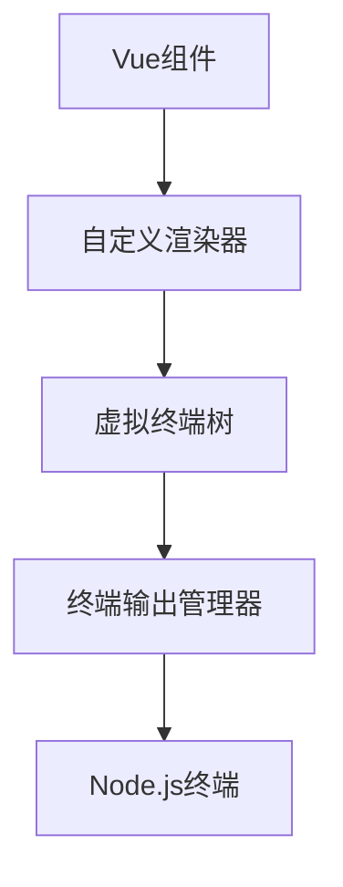

# Vue组件终端渲染方案设计

## 当前问题
1. 目前的实现依赖于Ink库进行终端渲染
2. 渲染逻辑与Ink强耦合,不够通用
3. 缺少对终端特性(如颜色、样式)的原生支持

## 解决方案

### 1. 自定义终端渲染器
#### 核心思路
- 完全脱离Ink库,实现原生终端渲染
- 使用ANSI转义序列实现终端样式
- 实现一个虚拟终端树(VTree)来管理终端输出

#### 技术实现


### 2. 核心模块设计

#### 2.1 终端元素抽象层
```typescript
interface TerminalElement {
  type: string;           // 元素类型
  content?: string;       // 文本内容
  style?: TerminalStyle;  // 终端样式
  children: TerminalElement[]; // 子元素
  parent?: TerminalElement;    // 父元素
}

interface TerminalStyle {
  color?: string;        // 文字颜色
  backgroundColor?: string; // 背景颜色
  bold?: boolean;        // 粗体
  underline?: boolean;   // 下划线
  // 其他终端支持的样式...
}
```

#### 2.2 渲染器改造方案

1. nodeOps改造:
```javascript
const nodeOps = {
  createElement(type) {
    return createTerminalElement(type);
  },
  
  insert(child, parent, anchor) {
    insertTerminalElement(child, parent, anchor);
    renderToTerminal(parent); // 触发终端重绘
  },
  
  patchProp(el, key, prevValue, nextValue) {
    updateTerminalElementProp(el, key, nextValue);
    renderToTerminal(el.parent); // 触发父节点重绘
  },
  
  // 其他必要的操作...
}
```

2. 终端渲染管理器:
```javascript
class TerminalRenderer {
  constructor() {
    this.rootElement = null;
    this.isRenderScheduled = false;
  }

  scheduleRender() {
    if (!this.isRenderScheduled) {
      this.isRenderScheduled = true;
      process.nextTick(() => this.render());
    }
  }

  render() {
    // 清空终端当前内容
    console.clear();
    // 递归渲染虚拟终端树
    this.renderElement(this.rootElement);
    this.isRenderScheduled = false;
  }

  renderElement(element) {
    // 将虚拟终端元素转换为ANSI字符串并输出
  }
}
```

### 3. 新增终端专用组件

创建一系列终端专用的基础组件:
- Terminal.Box: 用于创建边框和容器
- Terminal.Text: 文本显示组件
- Terminal.Input: 用户输入组件
- Terminal.Progress: 进度条组件

### 4. 交互性支持

1. 实现终端事件系统:
```javascript
class TerminalEventManager {
  constructor() {
    this.listeners = new Map();
    this.setupRawMode();
  }

  setupRawMode() {
    // 配置终端为raw模式以捕获用户输入
    process.stdin.setRawMode(true);
    process.stdin.on('data', this.handleInput.bind(this));
  }

  handleInput(data) {
    // 处理用户输入并触发相应事件
  }
}
```

2. 支持的交互类型:
- 键盘导航
- 按钮点击
- 表单输入
- 菜单选择

## 实施步骤

1. 基础架构搭建
   - 实现终端元素抽象层
   - 创建终端渲染管理器
   - 设计事件系统

2. 渲染器开发
   - 实现基本的渲染操作
   - 添加样式支持
   - 优化渲染性能

3. 组件库开发
   - 实现基础组件集
   - 添加交互支持
   - 编写使用文档

4. 测试与优化
   - 单元测试覆盖
   - 性能测试
   - 用户体验优化

## 预期效果

1. 性能提升
   - 减少渲染开销
   - 优化更新机制
   - 降低内存占用

2. 更好的可维护性
   - 解耦渲染逻辑
   - 标准化组件接口
   - 清晰的代码结构

3. 增强的功能
   - 原生终端样式支持
   - 丰富的交互能力
   - 更好的可扩展性
